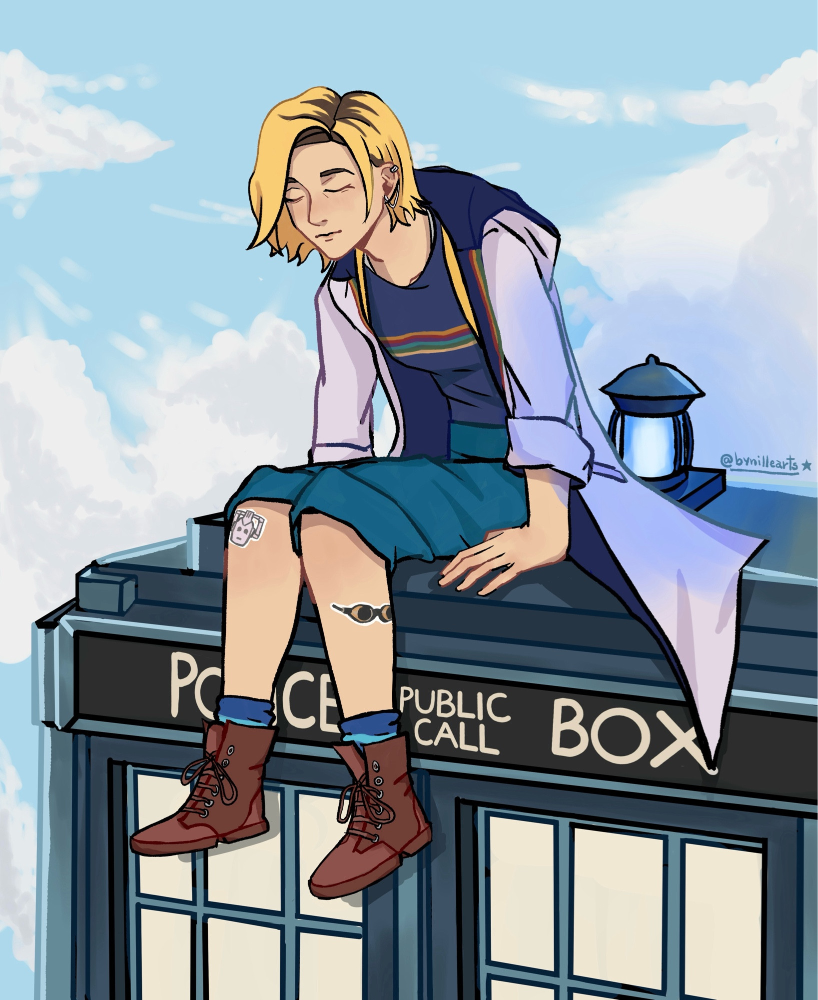

------------------- 
<h1>Titulo</h1>


<div align="right">
> Citaçao “Mundos inteiros giram em torno de atos de imaginação.” - Décima terceira doutora 🌙

Oeeee, me chamo Nicolle, deixando aqui um sobre mim🌱:

- Artista 🎨
- Faço pixelart
- Aprendendo Front-end 
- Ominigun feito por mim e meu namorado, já disponível na [steam](https://store.steampowered.com/app/3817830/Ominigun/) 🌟
- Iniciando um novo projeto de game🎮


 
<div 
- Lista
- Lista 1

- [ ] Check

_italico_

*negrito*

`marcado`

</div>

</br>

```bash
var codigo = 123
```
Normal frase

frase 1


frase dois

[link](https://bsky.app/profile/bynillearts.bsky.social)


#### Titulo